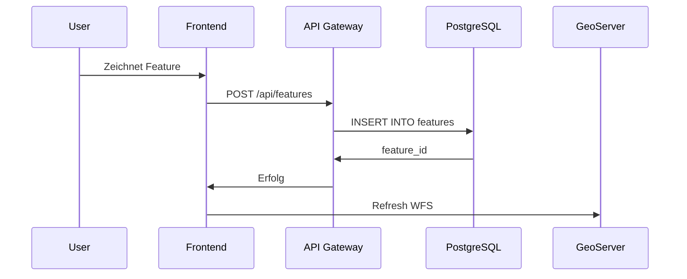

---
quality:
  completeness: 50
  accuracy: 70
  reviewed: false
  reviewer: null
  reviewDate: null
---

# Software-Architektur

Die Software-Architektur von p2d2 folgt einer **Microservices-ähnlichen Struktur** mit klarer Trennung zwischen Frontend, Backend-Services und Geodateninfrastruktur.

## Architektur-Übersicht

```
┌─────────────────────────────────────────────────────────┐
│                    p2d2 Frontend                        │
│              (AstroJS + OpenLayers)                     │
└────────┬──────────────────────┬─────────────────────────┘
         │                      │
         │                      │
    ┌────▼─────┐           ┌────▼──────┐
    │   API    │           │  WFS/WMS  │
    │ Gateway  │           │ (GeoServer)│
    └────┬─────┘           └────┬──────┘
         │                      │
         │    ┌─────────────────┘
         │    │
    ┌────▼────▼─────┐
    │  PostgreSQL   │
    │   + PostGIS   │
    └───────────────┘
```

## Komponenten

### Frontend (p2d2-app)

**Technologie**: AstroJS, TypeScript, OpenLayers

**Verantwortlichkeiten**:
- Kartendarstellung
- Feature-Editing
- Qualitätssicherungs-UI
- Offline-Funktionalität

### API-Gateway

**Technologie**: Node.js/Express (geplant: Fastify)

**Endpunkte**:
```
GET    /api/features              # Liste aller Features
GET    /api/features/:id          # Einzelnes Feature
POST   /api/features              # Neues Feature
PUT    /api/features/:id          # Feature aktualisieren
DELETE /api/features/:id          # Feature löschen
POST   /api/qc/submit             # Zur QC einreichen
GET    /api/qc/queue              # QC-Warteschlange
POST   /api/qc/approve/:id        # QC freigeben
POST   /api/qc/reject/:id         # QC ablehnen
```

### GeoServer

**OGC-Services**:
- WFS 2.0: Feature-Zugriff
- WFS-T: Feature-Editing
- WMS 1.3.0: Kartendarstellung
- WCS: Raster-Daten (zukünftig)

### PostgreSQL/PostGIS

**Datenbank-Schema**:
```
features.*     # Feature-Daten
metadata.*     # Metadaten
history.*      # Versionshistorie
qc.*           # Qualitätssicherung
users.*        # Benutzerverwaltung
```

## Datenfluss

### Feature-Erstellung



### Qualitätssicherung

```
1. User reicht Feature zur QC ein
2. Feature → Status "in_qc"
3. QC-Prüfer wird benachrichtigt
4. Prüfer öffnet Feature
5. Entscheidung: Freigeben/Ablehnen
6. Bei Freigabe: Export zu OSM/WikiData
```

## Module

### Feature-Manager

```typescript
// src/services/featureManager.ts
export class FeatureManager {
  async create(feature: GeoJSON.Feature): Promise<string>
  async update(id: string, feature: GeoJSON.Feature): Promise<void>
  async delete(id: string): Promise<void>
  async get(id: string): Promise<GeoJSON.Feature>
  async list(bbox?: number[]): Promise<GeoJSON.FeatureCollection>
}
```

### QC-Manager

```typescript
// src/services/qcManager.ts
export class QCManager {
  async submit(featureId: string, comment: string): Promise<void>
  async approve(featureId: string, reviewer: string): Promise<void>
  async reject(featureId: string, reason: string): Promise<void>
  async getQueue(): Promise<QCItem[]>
}
```

### Export-Manager

```typescript
// src/services/exportManager.ts
export class ExportManager {
  async exportToOSM(featureId: string): Promise<void>
  async exportToWikiData(featureId: string): Promise<void>
  async notifyAgency(featureId: string, changes: Changeset): Promise<void>
}
```

## Sicherheit

### Authentifizierung

- **OAuth2/OpenID Connect** (geplant)
- **Session-based Auth** (aktuell)
- **JWT** für API-Zugriff

### Autorisierung

**Rollen**:
- `guest`: Nur Lesen
- `contributor`: Erstellen + Editieren eigener Features
- `reviewer`: QC durchführen
- `admin`: Alle Rechte

**Permissions**:
```typescript
const permissions = {
  guest: ['read'],
  contributor: ['read', 'create', 'update:own', 'qc:submit'],
  reviewer: ['read', 'create', 'update:own', 'qc:*'],
  admin: ['*']
};
```

### Input-Validierung

```typescript
import { z } from 'zod';

const featureSchema = z.object({
  type: z.literal('Feature'),
  properties: z.object({
    name: z.string().min(1).max(255),
    kategorie: z.enum(['friedhof', 'blumenbeet', 'denkmal']),
    adresse: z.string().optional(),
    telefon: z.string().regex(/^\+?[0-9\s-]+$/).optional()
  }),
  geometry: z.object({
    type: z.enum(['Point', 'LineString', 'Polygon', 'MultiPolygon']),
    coordinates: z.array(z.any())
  })
});
```

## Error Handling

```typescript
export class P2D2Error extends Error {
  constructor(
    public code: string,
    message: string,
    public statusCode: number = 500
  ) {
    super(message);
  }
}

// Beispiel
throw new P2D2Error('FEATURE_NOT_FOUND', 'Feature nicht gefunden', 404);
```

## Logging

```typescript
import pino from 'pino';

const logger = pino({
  level: process.env.LOG_LEVEL || 'info',
  transport: {
    target: 'pino-pretty',
    options: {
      colorize: true
    }
  }
});

logger.info({ featureId: '123' }, 'Feature erstellt');
```

## Testing

### Unit-Tests

```typescript
// tests/featureManager.test.ts
import { describe, it, expect } from 'vitest';
import { FeatureManager } from '../src/services/featureManager';

describe('FeatureManager', () => {
  it('should create a feature', async () => {
    const manager = new FeatureManager();
    const id = await manager.create(mockFeature);
    expect(id).toBeDefined();
  });
});
```

### Integration-Tests

```typescript
// tests/api.integration.test.ts
import request from 'supertest';
import app from '../src/app';

describe('API Integration', () => {
  it('POST /api/features should create feature', async () => {
    const response = await request(app)
      .post('/api/features')
      .send(mockFeature)
      .expect(201);
    
    expect(response.body.id).toBeDefined();
  });
});
```

::: tip Clean Architecture
Die Architektur folgt Clean Architecture-Prinzipien mit klarer Trennung zwischen Domain, Application und Infrastructure.
:::
