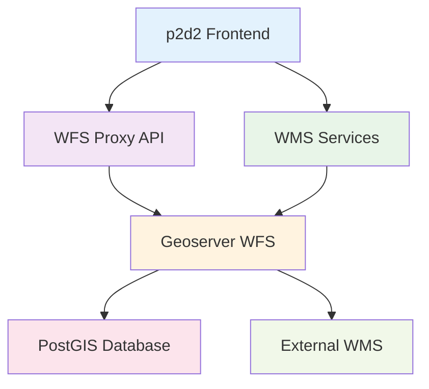

# Geoserver Integration

> **Status:** ✅ Vollständig dokumentiert

## Übersicht

Die Geoserver Integration in p2d2 ermöglicht den Zugriff auf professionelle Geodaten-Services über standardisierte OGC-Protokolle (WMS, WFS, WFS-T). Die Implementierung bietet sichere Authentifizierung, performantes Layer-Management und robuste Fehlerbehandlung.

## Architektur

### Service-Integration Overview



## WMS Services Integration

### Luftbild WMS Layer

```typescript
/**
 * Erstellt Luftbild-WMS-Layer für Köln
 * Service: Stadt Köln Luftbilder 2024
 * URL: https://geoportal.stadt-koeln.de/wss/service/luftbilder_2024_wms/guest
 */
export function createLuftbildLayer(projection: string): TileLayer {
  const supportedProjections = ["EPSG:3857", "EPSG:25832"];
  const useProjection = supportedProjections.includes(projection)
    ? projection
    : "EPSG:3857";

  const layer = new TileLayer({
    source: new TileWMS({
      url: "https://geoportal.stadt-koeln.de/wss/service/luftbilder_2024_wms/guest",
      params: {
        LAYERS: "luftbilder_2024_23",
        FORMAT: "image/png",
        TILED: true,
      },
      projection: useProjection,
      crossOrigin: "anonymous",
    }),
    zIndex: MAP_CONFIG.Z_INDEX.LUFTBILD,
    visible: false,
  });

  return layer;
}
```

### Basemap.de WMS Layer

```typescript
/**
 * Erstellt basemap.de WMS-Layer
 * Service: Geodatenzentrum basemap.de
 * URL: https://sgx.geodatenzentrum.de/wms_basemapde
 */
export function createBasemapLayer(): TileLayer {
  const layer = new TileLayer({
    source: new TileWMS({
      url: "https://sgx.geodatenzentrum.de/wms_basapde",
      params: {
        LAYERS: "de_basemapde_web_raster_farbe",
        FORMAT: "image/png",
        TRANSPARENT: "true",
        TILED: true,
      },
      projection: "EPSG:3857",
      crossOrigin: "anonymous",
    }),
    zIndex: MAP_CONFIG.Z_INDEX.BASEMAP,
    visible: false,
  });

  return layer;
}
```

## WFS Services Integration

::: info Architektur-Update
Die in diesem Abschnitt beschriebene direkte `WFSLayerManager`-API gilt als **Legacy**. Für neue Features wird der reaktive State-first-Ansatz empfohlen, bei dem der `WFSLayerManager` automatisch auf Änderungen im globalen `mapState` reagiert.

Details zur neuen Architektur: [WFS-Layer-Architektur](../architektur/wfs-layer-architektur.md)
:::

### WFS Layer Management

::: warning Legacy-API
Diese direkte `WFSLayerManager`-API wird nicht mehr für neue Features empfohlen. Stattdessen sollte der reaktive State-first-Ansatz verwendet werden, bei dem UI-Komponenten nur noch `mapState.setSelectedKommune(...)` und `mapState.setSelectedCategory(...)` aufrufen und der `WFSLayerManager` reaktiv auf State-Änderungen reagiert.

Siehe: [WFS-Layer-Architektur](../architektur/wfs-layer-architektur.md)
:::

```typescript
export class WFSLayerManager {
  private map: OLMap;
  private activeLayer: VectorLayer<VectorSource> | null = null;
  private layerCache = new Map<string, VectorLayer<VectorSource>>();

  /**
   * Zeigt WFS-Layer für Kommune und Kategorie an
   */
  async displayLayer(kommune: KommuneData, categorySlug: string): Promise<void> {
    const config = this.buildLayerConfig(kommune, categorySlug);
    const cacheKey = `${config.wpName}-${config.containerType}-${config.osmAdminLevel}`;

    // Caching für Performance
    let layer = this.layerCache.get(cacheKey);
    if (!layer) {
      layer = await this.createWFSLayer(config);
      this.layerCache.set(cacheKey, layer);
      this.map.addLayer(layer);
    }

    this.activeLayer = layer;
    this.activeLayer.setVisible(true);
  }

  private buildLayerConfig(kommune: KommuneData, categorySlug: string): WFSLayerConfig {
    const containerType = this.getContainerType(categorySlug);
    const osmAdminLevel = this.getOsmAdminLevel(kommune, containerType);

    return {
      wpName: kommune.wp_name,
      containerType,
      osmAdminLevel,
    };
  }
}
```

### WFS Query Builder

```typescript
// CQL-Filter für verschiedene Szenarien
const WFS_FILTERS = {
  // Administrative Grenzen
  administrative: (wpName: string, adminLevel: number) => 
    `wp_name='${wpName}' AND container_type='administrative' AND osm_admin_level=${adminLevel}`,
  
  // Friedhöfe
  cemetery: (wpName: string) => 
    `wp_name='${wpName}' AND container_type='cemetery' AND osm_admin_level=8`,
  
  // BBox-basierte Abfragen
  bbox: (bbox: number[], crs: string = "EPSG:4326") => 
    `BBOX(geometry,${bbox.join(',')},'${crs}')`
};

// WFS-URL Konstruktion
function buildWFSURL(typeName: string, params: Record<string, string>): string {
  const baseParams = {
    service: "WFS",
    version: "2.0.0",
    request: "GetFeature",
    typeName: `Verwaltungsdaten:${typeName}`,
    outputFormat: "application/json",
    srsName: "EPSG:4326",
    ...params
  };

  const queryString = Object.entries(baseParams)
    .map(([key, value]) => `${key}=${encodeURIComponent(String(value))}`)
    .join("&");

  return `https://wfs.data-dna.eu/geoserver/ows?${queryString}`;
}
```

## Authentication & Security

### WFS Auth Client

```typescript
export class WFSAuthClient {
  private config: WFSConfig;

  constructor(config: Partial<WFSConfig> = {}) {
    this.config = {
      endpoint: config.endpoint || "https://wfs.data-dna.eu/geoserver/ows",
      workspace: config.workspace || "Verwaltungsdaten",
      namespace: config.namespace || "urn:data-dna:govdata",
      credentials: {
        username: config.credentials?.username || "p2d2_wfs_user",
        password: config.credentials?.password || "eif1nu4ao9Loh0oobeev"
      },
    };
  }

  /**
   * Erstellt autorisierte WFS-URL mit Proxy
   */
  buildAuthorizedWFSURL(typeName: string, params: Record<string, string> = {}): string {
    const baseParams = {
      service: "WFS",
      version: "2.0.0",
      request: "GetFeature",
      typeName: `${this.config.workspace}:${typeName}`,
      outputFormat: "application/json",
      srsName: "EPSG:4326",
      ...params
    };

    const queryString = Object.entries(baseParams)
      .map(([key, value]) => `${key}=${encodeURIComponent(String(value))}`)
      .join("&");

    const wfsUrl = `${this.config.endpoint}?${queryString}`;
    
    // Proxy für CORS und Authentifizierung
    const encodedWfsUrl = encodeURIComponent(wfsUrl);
    return `/api/wfs-proxy?url=${encodedWfsUrl}`;
  }
}
```

### Security Features

```typescript
// WFS Proxy Security
const allowedHosts = ["wfs.data-dna.eu", "ows.data-dna.eu"];

function validateWFSURL(url: string): boolean {
  try {
    const urlHost = new URL(url).hostname;
    return allowedHosts.includes(urlHost);
  } catch {
    return false;
  }
}

// Credential Management
function getWFSCredentials(): WFSCredentials {
  // Bevorzuge Environment-Variablen
  return {
    username: import.meta.env.WFS_USERNAME || "p2d2_wfs_user",
    password: import.meta.env.WFS_PASSWORD || "eif1nu4ao9Loh0oobeev"
  };
}
```

## Layer Styling & Configuration

### Vector Layer Styles

```typescript
// Standard-Styles für WFS-Vektorlayer
const WFS_LAYER_STYLES = {
  default: new Style({
    stroke: new Stroke({
      color: "#FF6900",  // p2d2 Orange
      width: 2,
    }),
    fill: new Fill({
      color: "rgba(255, 105, 0, 0.1)",
    }),
  }),
  
  highlighted: new Style({
    stroke: new Stroke({
      color: "#FF4500",
      width: 3,
    }),
    fill: new Fill({
      color: "rgba(255, 69, 0, 0.2)",
    }),
  }),
  
  selected: new Style({
    stroke: new Stroke({
      color: "#DC143C",  // Rot für Selektion
      width: 4,
    }),
    fill: new Fill({
      color: "rgba(220, 20, 60, 0.3)",
    }),
  })
};

// Dynamisches Styling basierend auf Feature-Eigenschaften
function getStyleForFeature(feature: Feature): Style {
  const properties = feature.getProperties();
  
  if (properties.container_type === 'cemetery') {
    return new Style({
      stroke: new Stroke({
        color: '#8B4513',  // Braun für Friedhöfe
        width: 2,
      }),
      fill: new Fill({
        color: 'rgba(139, 69, 19, 0.1)',
      }),
    });
  }
  
  return WFS_LAYER_STYLES.default;
}
```

## Performance Optimizations

### Layer Caching

```typescript
// Legacy-API: Dieser Caching-Ansatz basiert auf der direkten WFSLayerManager-API
// Für neue Features stattdessen den reaktiven State-first-Ansatz verwenden
class CachedWFSLayerManager extends WFSLayerManager {
  private layerCache = new Map<string, VectorLayer<VectorSource>>();
  private cacheHits = 0;
  private cacheMisses = 0;

  async getCachedLayer(config: WFSLayerConfig): Promise<VectorLayer<VectorSource>> {
    const cacheKey = this.generateCacheKey(config);
    
    if (this.layerCache.has(cacheKey)) {
      this.cacheHits++;
      return this.layerCache.get(cacheKey)!;
    }
    
    this.cacheMisses++;
    const layer = await this.createWFSLayer(config);
    this.layerCache.set(cacheKey, layer);
    
    return layer;
  }

  getCacheStats() {
    const total = this.cacheHits + this.cacheMisses;
    const hitRate = total > 0 ? (this.cacheHits / total) * 100 : 0;
    
    return {
      hits: this.cacheHits,
      misses: this.cacheMisses,
      hitRate: `${hitRate.toFixed(1)}%`,
      cacheSize: this.layerCache.size
    };
  }
}
```

### Request Batching

```typescript
// Batch-Verarbeitung für mehrere WFS-Requests
async function batchWFSRequests(requests: WFSRequest[]): Promise<WFSResult[]> {
  const batches = chunkArray(requests, 5); // 5 Requests pro Batch
  
  const results: WFSResult[] = [];
  
  for (const batch of batches) {
    const batchPromises = batch.map(req => 
      wfsAuthClient.getFeatures(req.typeName, req.params)
    );
    
    const batchResults = await Promise.allSettled(batchPromises);
    
    batchResults.forEach((result, index) => {
      if (result.status === 'fulfilled') {
        results.push({
          request: batch[index],
          data: result.value,
          success: true
        });
      } else {
        results.push({
          request: batch[index],
          error: result.reason,
          success: false
        });
      }
    });
    
    // Kurze Pause zwischen Batches
    await new Promise(resolve => setTimeout(resolve, 100));
  }
  
  return results;
}
```

## Error Handling & Retry Logic

### Robust WFS Operations

```typescript
async function resilientWFSOperation<T>(
  operation: string,
  fn: () => Promise<T>,
  options: {
    maxRetries?: number;
    retryDelay?: number;
    timeout?: number;
  } = {}
): Promise<T> {
  const { maxRetries = 3, retryDelay = 1000, timeout = 30000 } = options;
  
  for (let attempt = 0; attempt <= maxRetries; attempt++) {
    try {
      const controller = new AbortController();
      const timeoutId = setTimeout(() => controller.abort(), timeout);
      
      const result = await fn();
      
      clearTimeout(timeoutId);
      return result;
      
    } catch (error) {
      console.warn(`${operation} fehlgeschlagen (Versuch ${attempt + 1}/${maxRetries + 1})`, error);
      
      if (attempt === maxRetries) {
        throw new Error(`${operation} nach ${maxRetries + 1} Versuchen fehlgeschlagen: ${error.message}`);
      }
      
      // Exponentielles Backoff
      await new Promise(resolve => 
        setTimeout(resolve, retryDelay * Math.pow(2, attempt))
      );
    }
  }
  
  throw new Error('Unreachable code');
}
```

### Graceful Degradation

```typescript
// Fallback-Strategien bei Geoserver-Ausfall
async function loadGeodataWithFallback(
  kommune: KommuneData,
  category: string
): Promise<any> {
  try {
    // Primär: Geoserver WFS (Legacy-API – für neue Features stattdessen mapState verwenden)
    return await wfsManager.displayLayer(kommune, category);
    
  } catch (error) {
    console.error("Geoserver nicht verfügbar, verwende Fallbacks", error);
    
    // Fallback 1: Lokale GeoJSON-Daten
    const localData = await loadLocalGeoJSON(kommune.slug, category);
    if (localData) {
      return displayLocalData(localData);
    }
    
    // Fallback 2: Statische Grenzen
    const staticData = await loadStaticBoundaries(kommune);
    if (staticData) {
      return displayStaticData(staticData);
    }
    
    // Fallback 3: Benutzer informieren
    showUserNotification({
      type: "warning",
      message: "Geodaten vorübergehend nicht verfügbar",
      details: "Bitte versuchen Sie es später erneut",
      action: "retry"
    });
    
    throw error;
  }
}
```

## Monitoring & Logging

### Performance Monitoring

```typescript
interface GeoserverMetrics {
  requestCount: number;
  successCount: number;
  errorCount: number;
  averageResponseTime: number;
  endpointUsage: Record<string, number>;
}

class GeoserverMonitor {
  private metrics: GeoserverMetrics = {
    requestCount: 0,
    successCount: 0,
    errorCount: 0,
    averageResponseTime: 0,
    endpointUsage: {}
  };

  trackRequest(endpoint: string, startTime: number, success: boolean, error?: string) {
    this.metrics.requestCount++;
    
    if (success) {
      this.metrics.successCount++;
      const duration = Date.now() - startTime;
      this.updateAverageTime(duration);
    } else {
      this.metrics.errorCount++;
    }
    
    this.metrics.endpointUsage[endpoint] = (this.metrics.endpointUsage[endpoint] || 0) + 1;
    
    // Logging für Debugging
    if (process.env.DEBUG) {
      console.debug('Geoserver Request:', {
        endpoint,
        success,
        duration: Date.now() - startTime,
        error
      });
    }
  }

  getMetrics(): GeoserverMetrics {
    const successRate = this.metrics.requestCount > 0 
      ? (this.metrics.successCount / this.metrics.requestCount) * 100 
      : 0;
    
    return {
      ...this.metrics,
      successRate: `${successRate.toFixed(1)}%`
    };
  }
}
```

## Configuration

### Environment Configuration

```typescript
const GEOSERVER_CONFIG = {
  development: {
    wfs: {
      endpoint: "https://wfs.data-dna.eu/geoserver/ows",
      workspace: "Verwaltungsdaten",
      timeout: 30000,
      maxRetries: 3
    },
    wms: {
      endpoints: {
        luftbild: "https://geoportal.stadt-koeln.de/wss/service/luftbilder_2024_wms/guest",
        basemap: "https://sgx.geodatenzentrum.de/wms_basemapde"
      }
    }
  },
  production: {
    wfs: {
      endpoint: "https://wfs.data-dna.eu/geoserver/Verwaltungsdaten/ows",
      workspace: "Verwaltungsdaten",
      timeout: 60000,
      maxRetries: 5
    },
    wms: {
      endpoints: {
        luftbild: "https://geoportal.stadt-koeln.de/wss/service/luftbilder_2024_wms/guest",
        basemap: "https://sgx.geodatenzentrum.de/wms_basemapde"
      }
    }
  }
};
```

### Layer Configuration

```typescript
// Standard-Layer-Konfiguration
const LAYER_CONFIGS = {
  administrative: {
    containerType: "administrative",
    style: WFS_LAYER_STYLES.default,
    minZoom: 8,
    maxZoom: 18
 
