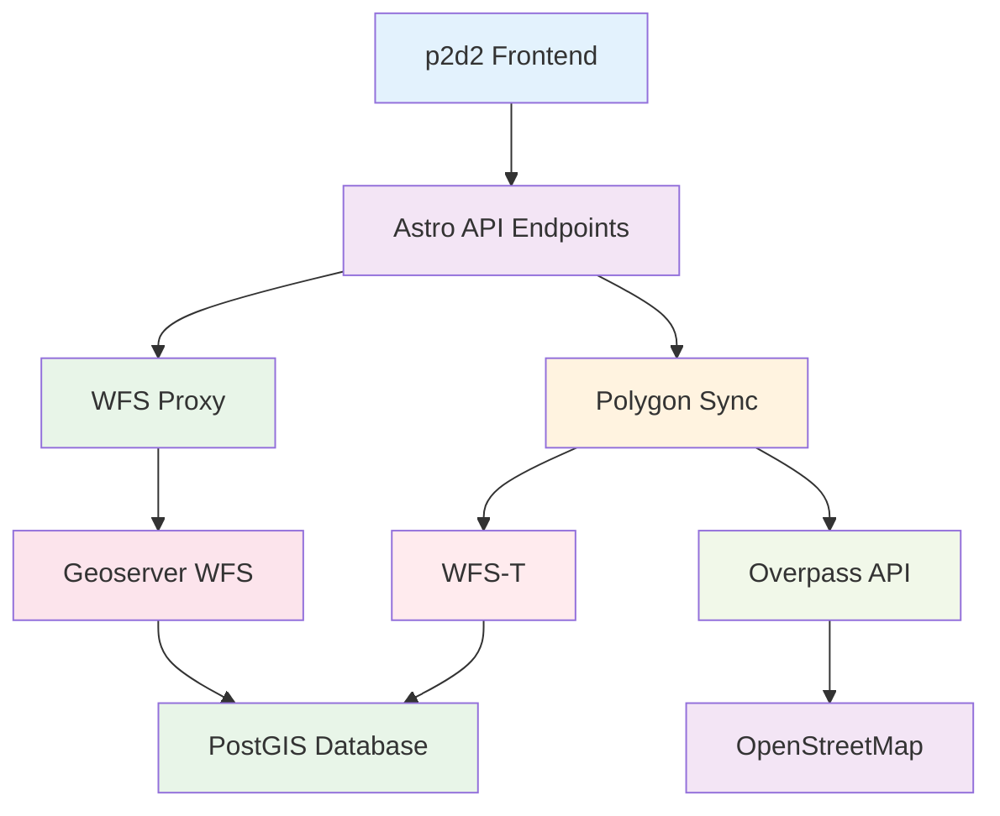

# API Services - Übersicht

> **Status:** ✅ Vollständig dokumentiert

## Einführung

Die p2d2-Anwendung integriert mehrere Backend-Services und APIs für professionelle Geodaten-Verarbeitung. Diese Services bilden das technische Fundament für die gesamte Daten-Infrastruktur und ermöglichen Echtzeit-Zugriff auf Geodaten, automatische Synchronisation und robuste Fehlerbehandlung.

## Service-Architektur

### Übersicht der Backend-Integrationen



## Hauptservice-Kategorien

### 🗺️ Geodaten Services

- **Geoserver Integration** - Professionelle WMS/WFS Services
- **WFS Transaction Management** - Schreibzugriff auf Geodatenbank
- **WMS Layer Management** - Rasterdaten und Basemaps

### 🔄 Synchronisation Services

- **Overpass API Integration** - OSM-Daten-Abruf mit Load-Balancing
- **Polygon Sync Engine** - Automatische Daten-Synchronisation
- **WFS-T Client** - Transaktions-basierte Daten-Persistenz

### 🔐 Security & Proxy Services

- **WFS Proxy API** - Sichere CORS-Umgehung und Authentifizierung
- **Credential Management** - Sicheres Handling von Service-Zugängen
- **Input Validation** - Robuste Eingabevalidierung

## Service-Eigenschaften

### 1. Robustheit & Error-Handling

Alle Services implementieren umfassende Fehlerbehandlung:

```typescript
// Retry-Mechanismus mit exponentiellem Backoff
async function resilientOperation(operation: string, fn: () => Promise<any>) {
  for (let attempt = 0; attempt <= maxRetries; attempt++) {
    try {
      return await fn();
    } catch (error) {
      if (attempt === maxRetries) throw error;
      await sleep(retryDelay * Math.pow(2, attempt)); // Exponentielles Backoff
    }
  }
}
```

### 2. Performance-Optimierungen

- **Layer Caching** - Wiederverwendung von geladenen Geodaten
- **Request Batching** - Effiziente Batch-Verarbeitung
- **Connection Pooling** - Wiederverwendung von HTTP-Connections

### 3. Sicherheitsfeatures

- **Host-Validierung** - Nur vertrauenswürdige Endpoints
- **Credential Encryption** - Sichere Speicherung von Zugangsdaten
- **Input Sanitization** - Schutz vor Injection-Angriffen

## Verwendungsbeispiele

### Komplette Service-Integration

```typescript
import { wfsAuthClient } from '../utils/wfs-auth';
import { syncKommunePolygons } from '../utils/polygon-wfst-sync';
import WFSLayerManager from '../utils/wfs-layer-manager';

// 1. WFS-Layer anzeigen
const wfsManager = new WFSLayerManager(map);
await wfsManager.displayLayer(kommune, 'administrative');

// 2. Polygon-Synchronisation
const syncResult = await syncKommunePolygons('koeln', ['admin_boundary']);
console.log('Sync erfolgreich:', syncResult.success);

// 3. WFS-Features abrufen
const features = await wfsAuthClient.getFeatures('p2d2_containers', {
  CQL_FILTER: "wp_name='Köln'"
});
```

### Error-Handling in der Praxis

```typescript
try {
  // Service-Operation mit Fallback
  const data = await loadGeodataWithFallback(kommune, category);
} catch (error) {
  // Umfassendes Logging
  logger.error('Service-Operation fehlgeschlagen', error, {
    kommune: kommune.slug,
    category: category,
    timestamp: new Date().toISOString()
  });
  
  // Benutzer-freundliche Fehlermeldung
  showUserNotification({
    type: 'error',
    message: 'Service vorübergehend nicht verfügbar',
    action: 'retry'
  });
}
```

## Monitoring & Debugging

### Performance-Metriken

```typescript
interface ServiceMetrics {
  requestCount: number;
  successRate: number;
  averageResponseTime: number;
  errorDistribution: Record<string, number>;
  cacheHitRate: number;
}

// Automatisches Monitoring
const metrics = serviceMonitor.getMetrics();
console.log('Service Performance:', {
  successRate: metrics.successRate,
  avgResponseTime: `${metrics.averageResponseTime}ms`,
  cacheEfficiency: metrics.cacheHitRate
});
```

### Debug-Logging

```typescript
// Detailliertes Debug-Logging
if (process.env.DEBUG) {
  console.debug('WFS-Request Details:', {
    url: wfsUrl,
    params: requestParams,
    timestamp: new Date().toISOString(),
    userAgent: navigator.userAgent
  });
}
```

## Konfiguration

### Environment-Variablen

```bash
# WFS Services
WFS_USERNAME="p2d2_wfs_user"
WFS_PASSWORD="eif1nu4ao9Loh0oobeev"
WFST_ENDPOINT="https://wfs.data-dna.eu/geoserver/ows"

# Performance
WFS_TIMEOUT=30000
WFS_MAX_RETRIES=3
CACHE_TTL=300000

# Debugging
DEBUG="true"
LOG_LEVEL="info"
```

### Service-Konfiguration

```typescript
const SERVICE_CONFIG = {
  wfs: {
    endpoints: {
      development: "https://wfs.data-dna.eu/geoserver/ows",
      production: "https://wfs.data-dna.eu/geoserver/Verwaltungsdaten/ows"
    },
    timeout: 30000,
    maxRetries: 3
  },
  overpass: {
    endpoints: [
      "https://overpass-api.de/api/interpreter",
      "https://overpass.kumi.systems/api/interpreter"
    ],
    timeout: 180,
    maxSize: 1073741824
  },
  caching: {
    layerTtl: 5 * 60 * 1000, // 5 Minuten
    featureTtl: 30 * 60 * 1000 // 30 Minuten
  }
};
```

## Best Practices

### 1. Service-Design

```typescript
// ✅ Korrekt - Klare Service-Schnittstellen
interface GeodataService {
  loadFeatures(kommune: KommuneData, category: string): Promise<FeatureCollection>;
  syncPolygons(slug: string, categories: string[]): Promise<SyncResult>;
  getLayerStats(): ServiceMetrics;
}

// ❌ Vermeiden - Unstrukturierte Service-Aufrufe
// Direkte fetch-Aufrufe ohne Abstraktion
```

### 2. Error-Handling

```typescript
// ✅ Korrekt - Umfassende Fehlerbehandlung
async function loadDataWithRetry() {
  try {
    return await resilientOperation('data-load', () => 
      geodataService.loadFeatures(kommune, category)
    );
  } catch (error) {
    if (error instanceof NetworkError) {
      return getCachedData(kommune, category);
    }
    throw error;
  }
}

// ❌ Vermeiden - Unbehandelte Fehler
const data = geodataService.loadFeatures(kommune, category);
```

### 3. Performance

```typescript
// ✅ Korrekt - Effiziente Service-Nutzung
const [features, statistics] = await Promise.all([
  wfsManager.getFeatures(kommune, 'administrative'),
  wfsManager.getLayerStats()
]);

// ❌ Vermeiden - Ineffiziente sequentielle Aufrufe
const features = await wfsManager.getFeatures(kommune, 'administrative');
const statistics = await wfsManager.getLayerStats(); // Blockierend
```

## Weiterführende Dokumentation

- [Astro API Endpoints](./astro-endpoints.md) - Backend-API Integrationen
- [WFS Transaction Management](./wfs-transactions.md) - WFS-T und Geoserver
- [Overpass API Integration](./overpass-api.md) - OSM-Daten-Abruf
- [Geoserver Integration](./geoserver-integration.md) - WMS/WFS Services

## Changelog

### v1.0.0 (2024-12-19)
- ✅ Vollständige Dokumentation aller API Services
- ✅ Robuste Error-Handling Implementierungen
- ✅ Performance-Optimierungen mit Caching
- ✅ Umfassende Sicherheitsfeatures
- ✅ Monitoring und Debugging Tools

Diese API Services bilden das technische Rückgrat von p2d2 und gewährleisten zuverlässigen Zugriff auf Geodaten mit professioneller Fehlerbehandlung und Performance-Optimierungen.