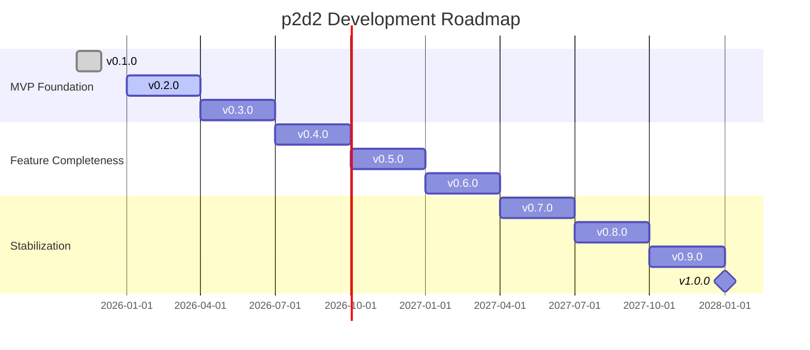
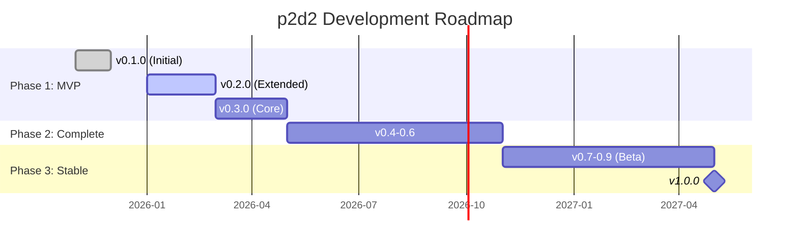
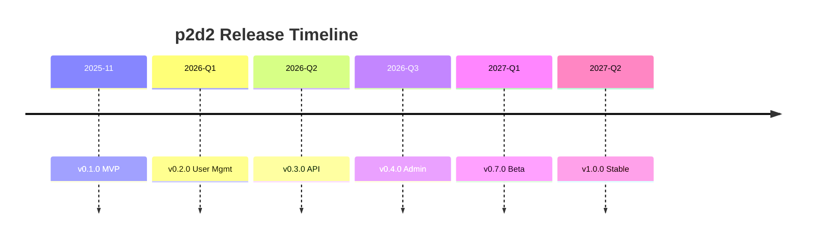

# Roadmap

## Entwicklungsphasen

### Phase 1: MVP Foundation (v0.1 - v0.3)
- **v0.1.0**: Grundlegende Middleware-Funktionalität
- **v0.2.0**: Erweiterte GDI-Funktionen
- **v0.3.0**: Performance-Optimierungen

### Phase 2: Feature Completeness (v0.4 - v0.6)
- **v0.4.0**: Erweiterte Analysemodule
- **v0.5.0**: Sicherheitsfeatures
- **v0.6.0**: Finale Feature-Set

### Phase 3: Stabilization (v0.7 - v1.0)
- **v0.7.0**: Bugfix-Phase
- **v0.8.0**: Beta-Testing
- **v0.9.0**: Release Candidate
- **v1.0.0**: Production Ready

## Zeitplan

.. testing

::: info Hinweis
Zeitangaben sind Schätzungen und können sich ändern.
:::
