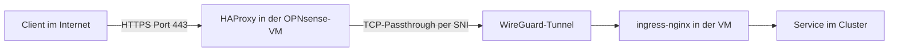

# Fall 1: hinter HAProxy

Die Plattform läuft im Verwaltungsnetz hinter einer OPNsense-VM. Ein HAProxy
leitet eingehenden HTTPS-Verkehr für `*.udp.<basisdomain>` per SNI als
TCP-Passthrough über einen WireGuard-Tunnel an die VM.

## Paketweg

## Komponenten

| Komponente | Rolle | Ort |
|---|---|---|
| Client im Internet | löst `udp.<basisdomain>` und `*.udp.<basisdomain>` auf `<edge-ip>` auf | außerhalb |
| Edge-Server | öffentlich erreichbarer Proxmox-Server | Standort des Betreibers |
| OPNsense-VM | trägt `<edge-ip>` an der WAN-Schnittstelle | auf dem Edge-Server |
| HAProxy | wertet den SNI-Namen aus und leitet den TCP-Strom weiter, terminiert kein TLS | in der OPNsense-VM |
| WireGuard-Tunnel | verbindet OPNsense und VM | zwischen OPNsense und VM |
| Proxmox-Knoten `civitas` | Bridge-Host, leitet nicht weiter | internes Netz |
| VM mit ingress-nginx | terminiert TLS, öffnet Port 80 und 443 | internes Netz |
| cert-manager | stellt Zertifikate per HTTP-01 aus | in der VM |

## Paketweg im Detail

1. Der Client verbindet sich mit `<edge-ip>` auf Port 443.
2. Der HAProxy nimmt die Verbindung an und liest den SNI-Namen.
3. Er ordnet den Namen `*.udp.<basisdomain>` zu und leitet den Datenstrom
   durch den WireGuard-Tunnel an `WG_VM_IP` auf Port 443.
4. Der ingress-nginx in der VM nimmt die Verbindung an. Der TLS-Handshake
   findet zwischen Client und Ingress statt. TLS endet im Ingress.
5. Der Ingress wählt anhand des Hostnamens den Service im Cluster.
6. Die Antwort läuft auf derselben Verbindung zurück.

## Netzwerkeinrichtung des Proxmox-Knotens

Der Knoten `civitas` ist ein reiner Bridge-Host. Die Bridge enthält die
physische Schnittstelle des Knotens. Die VM hängt per `net0` an dieser Bridge
und liegt im selben Layer-2-Segment wie das Gateway `<gateway-ip>`. Der Knoten
leitet nichts weiter: `net.ipv4.ip_forward = 0`, keine NAT-Regeln, keine
nftables-Regeln, `pve-firewall` deaktiviert.

## Netzwerk der VM

- Standardgateway ist `<gateway-ip>` im internen Netz.
- WireGuard läuft auf `wg0`. Die VM ist Peer mit der Adresse `WG_VM_IP`, die
  Gegenstelle ist `WG_OPN_ENDPOINT` mit der Tunneladresse `WG_OPN_IP`.
  `AllowedIPs` ist auf `WG_ALLOWED_IPS` begrenzt, `PersistentKeepalive` steht
  auf 25.
- Der ingress-nginx läuft als DaemonSet mit `hostNetwork: true` und ohne
  Kubernetes-Service. Er öffnet Port 80 und 443 direkt im Netzwerk der VM.
  Weitergeleiteter Verkehr erreicht ihn auf der Tunneladresse, interne Clients
  auf der LAN-Adresse.

## Voraussetzungen am Installer bei `WG_ENABLE=true`

Pflichtvariablen sind `WG_VM_PRIVATE_KEY`, `WG_OPN_PUBLIC_KEY` und
`WG_OPN_ENDPOINT`, optional ist `WG_PRESHARED_KEY`. Die Abnahme prüft
`wg-quick@wg0`, einen Ping auf `WG_OPN_IP` und die Erreichbarkeit von
`https://idm.udp.<basisdomain>/realms/master` und `https://udp.<basisdomain>/`.

## DNS

Im lokalen DNS des internen Netzes zeigen `udp.<basisdomain>` und
`idm.udp.<basisdomain>` auf `<vm-ip>`, `www.udp.<basisdomain>` auf die
öffentliche Adresse. Interne Clients erreichen die VM unter diesen Namen
direkt und nicht über HAProxy und Tunnel.
