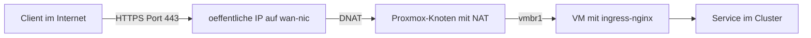

# Standalone

Die Plattform [udp.projekte-koenig.eu](https://udp.projekte-koenig.eu/) läuft
auf einem öffentlich erreichbaren Hetzner AX41-1-LTD in Nürnberg. Der
Proxmox-Knoten leitet eingehenden Verkehr per NAT an die VM.

## Paketweg



## Komponenten

| Komponente | Rolle |
|---|---|
| Client im Internet | löst `udp.<basisdomain>`, `www.udp.<basisdomain>` und `idm.udp.<basisdomain>` auf `<oeffentliche-ip>` auf |
| Server in Nürnberg | trägt die öffentliche IPv4 und IPv6 auf `<wan-nic>` |
| Proxmox-Knoten | Router und NAT-Gerät |
| Bridge `vmbr1` | isoliertes Netz `<vm-netz>` ohne physischen Port |
| VM mit ingress-nginx | terminiert TLS, öffnet Port 80 und 443 |
| cert-manager | stellt Zertifikate per HTTP-01 aus |
| SSH | Port 8022 des Knotens führt auf Port 22 der VM |

## Netzwerkeinrichtung des Proxmox-Knotens

`<wan-nic>` trägt die öffentliche IPv4 und IPv6, dort liegt das Standardgateway
des Hosters. `net.ipv4.ip_forward = 1` und
`net.ipv6.conf.all.forwarding = 1` sind gesetzt. Als Netfilter-Backend ist
iptables legacy aktiv. `pve-firewall` ist deaktiviert, `proxmox-firewall` ist
inaktiv.

Die Bridge `vmbr1` hat keinen physischen Port (`bridge-ports none`). Sie trägt
`<knoten-ip>` und bildet das isolierte Netz `<vm-netz>`. Die VM hängt per
`net0` an dieser Bridge. Der Knoten ist das einzige Gateway der VM, die
Cloud-Init-Konfiguration setzt als Gateway die Adresse der Bridge.

Die FORWARD-Policy ist ACCEPT, zusätzlich bestehen zwei ACCEPT-Regeln für TCP
22 zur VM.

## Regelsatz auf dem Knoten

Die folgenden Befehle wurden in dieser Form nicht ausgeführt. Die auf dem
Knoten vorhandenen Regeln sind die Referenz.

```bash
iptables -t nat -A PREROUTING -d <oeffentliche-ip>/32 -i <wan-nic> -p tcp -m multiport --dports 80,443 -j DNAT --to-destination <vm-ip>
iptables -t nat -A PREROUTING -d <oeffentliche-ip>/32 -i vmbr1 -p tcp -m multiport --dports 80,443 -j DNAT --to-destination <vm-ip>
iptables -t nat -A PREROUTING -i <wan-nic> -p tcp -m tcp --dport 8022 -j DNAT --to-destination <vm-ip>:22
iptables -t nat -A POSTROUTING -s <vm-netz> -o <wan-nic> -j MASQUERADE
iptables -t nat -A POSTROUTING -s <vm-netz> -d <vm-ip>/32 -o vmbr1 -p tcp -m multiport --dports 80,443 -j MASQUERADE
```

Rolle der Regeln:

1. Regel 1 stellt Anfragen aus dem Internet auf Port 80 und 443 der VM zu.
2. Regel 3 stellt Port 8022 des Knotens auf Port 22 der VM zu.
3. Regel 4 versorgt die VM mit ausgehendem Internetzugang.
4. Regel 2 und Regel 5 bilden Hairpin-NAT für Zugriffe der VM auf die
   öffentliche Adresse: Regel 2 leitet diese Zugriffe an die VM selbst,
   Regel 5 ersetzt dabei die Quelladresse, damit die Antwort über den Knoten
   zurückläuft.

## Paketwege

### HTTPS aus dem Internet

1. Der Client verbindet sich mit `<oeffentliche-ip>` auf Port 443. Das Paket
   erreicht `<wan-nic>`.
2. Die PREROUTING-Regel ersetzt die Zieladresse durch `<vm-ip>`.
3. Der Knoten leitet das Paket über `vmbr1` an die VM weiter. Die
   FORWARD-Policy lässt es durch.
4. Der ingress-nginx in der VM nimmt die Verbindung an. Der TLS-Handshake
   findet zwischen Client und Ingress statt.
5. Die Antwort verlässt die VM über ihr Standardgateway, den Knoten. Der
   Knoten macht die Adressumsetzung rückgängig. Die Quelladresse des Clients
   bleibt erhalten, weil die MASQUERADE-Regel nur für Pakete aus `<vm-netz>`
   gilt, die über `<wan-nic>` das Netz verlassen.

### SSH

1. Der Client verbindet sich mit `<oeffentliche-ip>` auf Port 8022.
2. Die PREROUTING-Regel ersetzt Ziel und Port durch `<vm-ip>` und 22.
3. Der SSH-Dienst der VM antwortet. Der Host-Key stammt von der VM.

### Ausgehender Verkehr

1. Die VM sendet an ihr Standardgateway, den Knoten.
2. Die MASQUERADE-Regel ersetzt die Quelladresse durch die öffentliche Adresse
   auf `<wan-nic>`.

### Zugriff der VM auf die eigene öffentliche Adresse

1. Das Paket erreicht den Knoten über `vmbr1`.
2. Regel 2 ersetzt die Zieladresse durch `<vm-ip>`.
3. Regel 5 ersetzt die Quelladresse, damit die Antwort den Knoten durchläuft.

## Persistenz

Die Bridge ruft in `/etc/network/interfaces` per `post-up` das Skript
`pve-nat.sh add` und per `post-down` das Skript `pve-nat.sh del` auf. Der
Inhalt des Skripts ist nicht dokumentiert.

## IPv6

Die VM hat eine statische ULA. Ausgehend gilt NAT66 per MASQUERADE für das
ULA-Netz über `<wan-nic>`. Für eingehenden IPv6-Verkehr gibt es keine
Weiterleitung.

## Zertifikate

Der Issuer `letsencrypt-prod` validiert per HTTP-01. Die Validierung erreicht
die VM über die Weiterleitung von Port 80.

## Zusammenhang mit dem Installer

Der Installer läuft in der Betriebsart Standalone mit `WG_ENABLE=false` und
richtet die NAT-Regeln nicht ein. Der Administrator richtet sie manuell ein.
