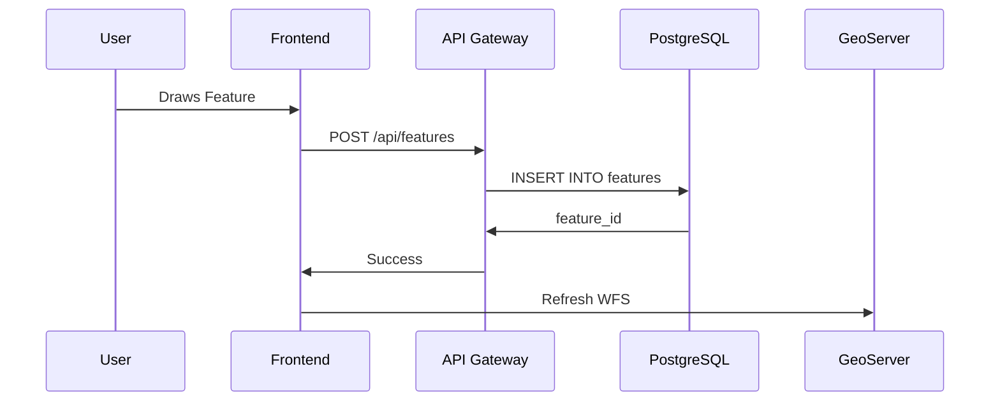

---
quality:
  completeness: 50
  accuracy: 30
  reviewed: false
  reviewer: 'KI (Gemini)'
  reviewDate: null
---

# Software Architecture

The software architecture of p2d2 follows a **microservices-like structure** with a clear separation between frontend, backend services, and geodata infrastructure.

## Architecture Overview

```
┌─────────────────────────────────────────────────────────┐
│                    p2d2 Frontend                        │
│              (AstroJS + OpenLayers)                     │
└────────┬──────────────────────┬─────────────────────────┘
         │                      │
         │                      │
    ┌────▼─────┐           ┌────▼──────┐
    │   API    │           │  WFS/WMS  │
    │ Gateway  │           │ (GeoServer)│
    └────┬─────┘           └────┬──────┘
         │                      │
         │    ┌─────────────────┘
         │    │
    ┌────▼────▼─────┐
    │  PostgreSQL   │
    │   + PostGIS   │
    └───────────────┘
```

## Components

### Frontend (p2d2-app)

**Technology**: AstroJS, TypeScript, OpenLayers

**Responsibilities**:
- Map display
- Feature editing
- Quality assurance UI
- Offline functionality

### API Gateway

**Technology**: Node.js/Express (planned: Fastify)

**Endpoints**:
```
GET    /api/features              # List all features
GET    /api/features/:id          # Single feature
POST   /api/features              # New feature
PUT    /api/features/:id          # Update feature
DELETE /api/features/:id          # Delete feature
POST   /api/qc/submit             # Submit for QC
GET    /api/qc/queue              # QC queue
POST   /api/qc/approve/:id        # Approve QC
POST   /api/qc/reject/:id         # Reject QC
```

### GeoServer

**OGC Services**:
- WFS 2.0: Feature access
- WFS-T: Feature editing
- WMS 1.3.0: Map display
- WCS: Raster data (future)

### PostgreSQL/PostGIS

**Database Schema**:
```
features.* # Feature data
metadata.* # Metadata
history.* # Version history
qc.* # Quality assurance
users.* # User management
```

## Data Flow

### Feature Creation



### Quality Assurance

```
1. User submits feature for QC
2. Feature → Status "in_qc"
3. QC reviewer is notified
4. Reviewer opens feature
5. Decision: Approve/Reject
6. If approved: Export to OSM/WikiData
```

## Modules

### Feature Manager

```typescript
// src/services/featureManager.ts
export class FeatureManager {
  async create(feature: GeoJSON.Feature): Promise<string>
  async update(id: string, feature: GeoJSON.Feature): Promise<void>
  async delete(id: string): Promise<void>
  async get(id: string): Promise<GeoJSON.Feature>
  async list(bbox?: number[]): Promise<GeoJSON.FeatureCollection>
}
```

### QC Manager

```typescript
// src/services/qcManager.ts
export class QCManager {
  async submit(featureId: string, comment: string): Promise<void>
  async approve(featureId: string, reviewer: string): Promise<void>
  async reject(featureId: string, reason: string): Promise<void>
  async getQueue(): Promise<QCItem[]>
}
```

### Export Manager

```typescript
// src/services/exportManager.ts
export class ExportManager {
  async exportToOSM(featureId: string): Promise<void>
  async exportToWikiData(featureId: string): Promise<void>
  async notifyAgency(featureId: string, changes: Changeset): Promise<void>
}
```

## Security

### Authentication

  - **OAuth2/OpenID Connect** (planned)
  - **Session-based Auth** (current)
  - **JWT** for API access

### Authorization

**Roles**:

  - `guest`: Read-only
  - `contributor`: Create + Edit own features
  - `reviewer`: Perform QC
  - `admin`: All rights

**Permissions**:

```typescript
const permissions = {
  guest: ['read'],
  contributor: ['read', 'create', 'update:own', 'qc:submit'],
  reviewer: ['read', 'create', 'update:own', 'qc:*'],
  admin: ['*']
};
```

### Input Validation

```typescript
import { z } from 'zod';

const featureSchema = z.object({
  type: z.literal('Feature'),
  properties: z.object({
    name: z.string().min(1).max(255),
    kategorie: z.enum(['friedhof', 'blumenbeet', 'denkmal']),
    adresse: z.string().optional(),
    telefon: z.string().regex(/^\+?[0-9\s-]+$/).optional()
  }),
  geometry: z.object({
    type: z.enum(['Point', 'LineString', 'Polygon', 'MultiPolygon']),
    coordinates: z.array(z.any())
  })
});
```

## Error Handling

```typescript
export class P2D2Error extends Error {
  constructor(
    public code: string,
    message: string,
    public statusCode: number = 500
  ) {
    super(message);
  }
}

// Example
throw new P2D2Error('FEATURE_NOT_FOUND', 'Feature not found', 404);
```

## Logging

```typescript
import pino from 'pino';

const logger = pino({
  level: process.env.LOG_LEVEL || 'info',
  transport: {
    target: 'pino-pretty',
    options: {
      colorize: true
    }
  }
});

logger.info({ featureId: '123' }, 'Feature created');
```

## Testing

### Unit Tests

```typescript
// tests/featureManager.test.ts
import { describe, it, expect } from 'vitest';
import { FeatureManager } from '../src/services/featureManager';

describe('FeatureManager', () => {
  it('should create a feature', async () => {
    const manager = new FeatureManager();
    const id = await manager.create(mockFeature);
    expect(id).toBeDefined();
  });
});
```

### Integration Tests

```typescript
// tests/api.integration.test.ts
import request from 'supertest';
import app from '../src/app';

describe('API Integration', () => {
  it('POST /api/features should create feature', async () => {
    const response = await request(app)
      .post('/api/features')
      .send(mockFeature)
      .expect(201);
    
    expect(response.body.id).toBeDefined();
  });
});
```

::: tip Clean Architecture
The architecture follows Clean Architecture principles with a clear separation between Domain, Application, and Infrastructure.
:::

> **Note:** This text was translated automatically with AI assistance and has not yet been reviewed by a human.