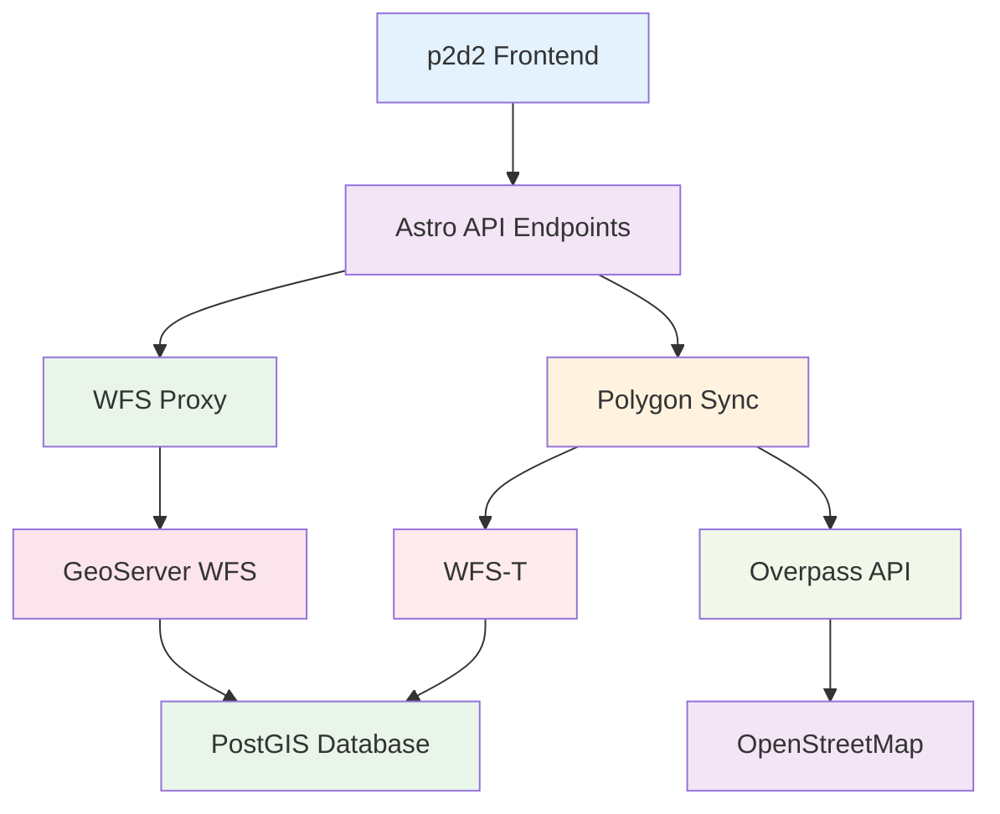

## title: API Services Overview description: Comprehensive documentation of all backend integrations, API endpoints, and service communication in p2d2 quality: completeness: 80 accuracy: 75 reviewed: false reviewer: 'KI (Gemini)' reviewDate: null

# API Services - Overview

> **Status:** ✅ Fully documented

## Introduction

The p2d2 application integrates multiple backend services and APIs for professional geodata processing. These services form the technical foundation for the entire data infrastructure, enabling real-time access to geodata, automatic synchronization, and robust error handling.

## Service Architecture

### Overview of Backend Integrations



## Main Service Categories

### 🗺️ Geodata Services

  - **GeoServer Integration** - Professional WMS/WFS Services
  - **WFS Transaction Management** - Write access to geodatabase
  - **WMS Layer Management** - Raster data and basemaps

### 🔄 Synchronization Services

  - **Overpass API Integration** - OSM data retrieval with load balancing
  - **Polygon Sync Engine** - Automatic data synchronization
  - **WFS-T Client** - Transaction-based data persistence

### 🔐 Security & Proxy Services

  - **WFS Proxy API** - Secure CORS circumvention and authentication
  - **Credential Management** - Secure handling of service credentials
  - **Input Validation** - Robust input validation

## Service Properties

### 1. Robustness & Error Handling

All services implement comprehensive error handling:

```typescript
// Retry mechanism with exponential backoff
async function resilientOperation(operation: string, fn: () => Promise<any>) {
  for (let attempt = 0; attempt <= maxRetries; attempt++) {
    try {
      return await fn();
    } catch (error) {
      if (attempt === maxRetries) throw error;
      await sleep(retryDelay * Math.pow(2, attempt)); // Exponential backoff
    }
  }
}
```

### 2. Performance Optimizations

  - **Layer Caching** - Reuse of loaded geodata
  - **Request Batching** - Efficient batch processing
  - **Connection Pooling** - Reuse of HTTP connections

### 3. Security Features

  - **Host Validation** - Only trusted endpoints
  - **Credential Encryption** - Secure storage of credentials
  - **Input Sanitization** - Protection against injection attacks

## Usage Examples

### Complete Service Integration

```typescript
import { wfsAuthClient } from '../utils/wfs-auth';
import { syncKommunePolygons } from '../utils/polygon-wfst-sync';
import WFSLayerManager from '../utils/wfs-layer-manager';

// 1. Display WFS layer
const wfsManager = new WFSLayerManager(map);
await wfsManager.displayLayer(kommune, 'administrative');

// 2. Polygon synchronization
const syncResult = await syncKommunePolygons('koeln', ['admin_boundary']);
console.log('Sync successful:', syncResult.success);

// 3. Fetch WFS features
const features = await wfsAuthClient.getFeatures('p2d2_containers', {
  CQL_FILTER: "wp_name='Köln'"
});
```

### Error Handling in Practice

```typescript
try {
  // Service operation with fallback
  const data = await loadGeodataWithFallback(kommune, category);
} catch (error) {
  // Comprehensive logging
  logger.error('Service operation failed', error, {
    kommune: kommune.slug,
    category: category,
    timestamp: new Date().toISOString()
  });
  
  // User-friendly error message
  showUserNotification({
    type: 'error',
    message: 'Service temporarily unavailable',
    action: 'retry'
  });
}
```

## Monitoring & Debugging

### Performance Metrics

```typescript
interface ServiceMetrics {
  requestCount: number;
  successRate: number;
  averageResponseTime: number;
  errorDistribution: Record<string, number>;
  cacheHitRate: number;
}

// Automatic monitoring
const metrics = serviceMonitor.getMetrics();
console.log('Service Performance:', {
  successRate: metrics.successRate,
  avgResponseTime: `${metrics.averageResponseTime}ms`,
  cacheEfficiency: metrics.cacheHitRate
});
```

### Debug Logging

```typescript
// Detailed debug logging
if (process.env.DEBUG) {
  console.debug('WFS-Request Details:', {
    url: wfsUrl,
    params: requestParams,
    timestamp: new Date().toISOString(),
    userAgent: navigator.userAgent
  });
}
```

## Configuration

### Environment Variables

```bash
# WFS Services
WFS_USERNAME="p2d2_wfs_user"
WFS_PASSWORD="eif1nu4ao9Loh0oobeev"
WFST_ENDPOINT="https://wfs.data-dna.eu/geoserver/ows"

# Performance
WFS_TIMEOUT=30000
WFS_MAX_RETRIES=3
CACHE_TTL=300000

# Debugging
DEBUG="true"
LOG_LEVEL="info"
```

### Service Configuration

```typescript
const SERVICE_CONFIG = {
  wfs: {
    endpoints: {
      development: "https://wfs.data-dna.eu/geoserver/ows",
      production: "https://wfs.data-dna.eu/geoserver/Verwaltungsdaten/ows"
    },
    timeout: 30000,
    maxRetries: 3
  },
  overpass: {
    endpoints: [
      "https://overpass-api.de/api/interpreter",
      "https://overpass.kumi.systems/api/interpreter"
    ],
    timeout: 180,
    maxSize: 1073741824
  },
  caching: {
    layerTtl: 5 * 60 * 1000, // 5 minutes
    featureTtl: 30 * 60 * 1000 // 30 minutes
  }
};
```

## Best Practices

### 1. Service Design

```typescript
// ✅ Correct - Clear service interfaces
interface GeodataService {
  loadFeatures(kommune: KommuneData, category: string): Promise<FeatureCollection>;
  syncPolygons(slug: string, categories: string[]): Promise<SyncResult>;
  getLayerStats(): ServiceMetrics;
}

// ❌ Avoid - Unstructured service calls
// Direct fetch calls without abstraction
```

### 2. Error Handling

```typescript
// ✅ Correct - Comprehensive error handling
async function loadDataWithRetry() {
  try {
    return await resilientOperation('data-load', () => 
      geodataService.loadFeatures(kommune, category)
    );
  } catch (error) {
    if (error instanceof NetworkError) {
      return getCachedData(kommune, category);
    }
    throw error;
  }
}

// ❌ Avoid - Unhandled errors
const data = geodataService.loadFeatures(kommune, category);
```

### 3. Performance

```typescript
// ✅ Correct - Efficient service usage
const [features, statistics] = await Promise.all([
  wfsManager.getFeatures(kommune, 'administrative'),
  wfsManager.getLayerStats()
]);

// ❌ Avoid - Inefficient sequential calls
const features = await wfsManager.getFeatures(kommune, 'administrative');
const statistics = await wfsManager.getLayerStats(); // Blocking
```

## Further Documentation

  - [Astro API Endpoints](./astro-endpoints.md) - Backend API Integrations
  - [WFS Transaction Management](./wfs-transactions.md) - WFS-T and GeoServer
  - [Overpass API Integration](./overpass-api.md) - OSM Data Retrieval
  - [GeoServer Integration](./geoserver-integration.md) - WMS/WFS Services

## Changelog

### v1.0.0 (2024-12-19)

  - ✅ Complete documentation of all API Services
  - ✅ Robust error handling implementations
  - ✅ Performance optimizations with caching
  - ✅ Comprehensive security features
  - ✅ Monitoring and debugging tools

## These API Services form the technical backbone of p2d2, ensuring reliable access to geodata with professional error handling and performance optimizations.