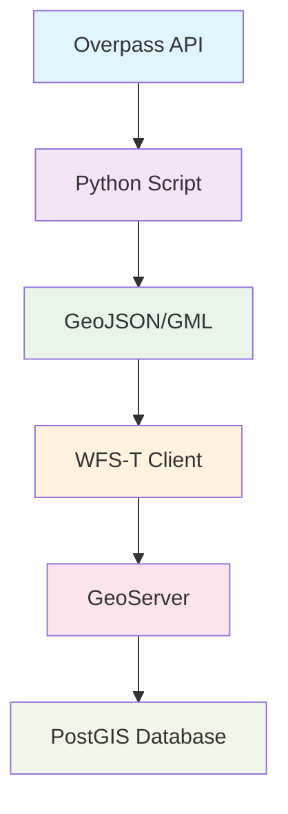

## title: WFS Transaction Management description: Comprehensive documentation for WFS-T (Web Feature Service Transaction) Management in p2d2 quality: completeness: 80 accuracy: 75 reviewed: false reviewer: 'KI (Gemini)' reviewDate: null

# WFS Transaction Management

> **Status:** ✅ Fully documented

## Overview

WFS-T (Web Feature Service Transaction) enables writing geodata to GeoServer via standardized XML transactions. p2d2 uses WFS-T for automatic synchronization of OSM polygons into the central geodatabase.

## WFS-T Architecture

### Transaction Workflow



### Main Components

1.  **WFS-T Client** (`WFSAuthClient`) - Authenticated transactions
2.  **XML Builder** - GML 3.2 compatible transaction XML
3.  **Python Bridge** - Overpass-API to WFS-T conversion
4.  **Error Handler** - Robust error handling with retry logic

## Core Implementation

### WFS-T Client Class

```typescript
export class WFSAuthClient {
  private config: WFSConfig;
  
  /**
   * Executes WFS-T transaction
   * @param transactionXml - Complete WFS-T XML
   * @returns Response with transaction result
   */
  async executeWFSTransaction(transactionXml: string): Promise<Response> {
    const headers = new Headers({
      "Content-Type": "application/xml",
    });

    // Basic Auth for WFS-T
    if (this.config.credentials.username && this.config.credentials.password) {
      const authString = btoa(
        `${this.config.credentials.username}:${this.config.credentials.password}`,
      );
      headers.set("Authorization", `Basic ${authString}`);
    }

    const response = await fetch(this.config.endpoint, {
      method: "POST",
      headers,
      body: transactionXml,
      credentials: "include" as RequestCredentials,
    });

    if (!response.ok) {
      throw new Error(
        `WFS-T transaction failed: ${response.status} ${response.statusText}`,
      );
    }

    return response;
  }
}
```

### Transaction XML Builder

```typescript
function buildWFSTInsertXML(records: PolygonRecord[]): string {
  const features = records.map(record => `
    <p2d2:p2d2_containers>
      <p2d2:container_type>${record.container_type}</p2d2:container_type>
      <p2d2:municipality>${escapeXml(record.municipality)}</p2d2:municipality>
      <p2d2:wp_name>${escapeXml(record.wp_name)}</p2d2:wp_name>
      <p2d2:osm_admin_level>${record.osm_admin_level}</p2d2:osm_admin_level>
      <p2d2:osm_id>${record.osm_id}</p2d2:osm_id>
      <p2d2:name>${escapeXml(record.name)}</p2d2:name>
      <p2d2:geometry>
        <gml:Polygon srsName="EPSG:4326">
          <gml:exterior>
            <gml:LinearRing>
              <gml:posList>${convertToGMLPosList(record.geometry)}</gml:posList>
            </gml:LinearRing>
          </gml:exterior>
        </gml:Polygon>
      </p2d2:geometry>
      <p2d2:created_at>${record.created_at}</p2d2:created_at>
      <p2d2:updated_at>${record.updated_at}</p2d2:updated_at>
    </p2d2:p2d2_containers>
  `).join('');

  return `<?xml version="1.0" encoding="UTF-8"?>
<wfs:Transaction xmlns:wfs="http://www.opengis.net/wfs/2.0" 
                 xmlns:fes="http://www.opengis.net/fes/2.0" 
                 xmlns:gml="http://www.opengis.net/gml/3.2" 
                 xmlns:p2d2="urn:data-dna:govdata" 
                 version="2.0.0" service="WFS">
  <wfs:Insert>
    ${features}
  </wfs:Insert>
</wfs:Transaction>`;
}
```

## Practical Usage

### Complete Polygon Synchronization

```typescript
import { syncKommunePolygons } from '../utils/polygon-wfst-sync';
import { WFSAuthClient } from '../utils/wfs-auth';

// 1. Polygon synchronization for municipality
async function syncKommuneData(slug: string) {
  const result = await syncKommunePolygons(slug, ['admin_boundary', 'cemetery']);
  
  console.log('Sync result:', {
    success: result.success,
    processedLevels: result.processedLevels,
    insertedPolygons: result.insertedPolygons,
    errors: result.errors
  });
  
  return result;
}

// 2. Manual WFS-T transaction
async function manualWFSTTransaction() {
  const wfsClient = WFSAuthClient.createWFSTClient();
  
  const transactionXml = buildWFSTInsertXML([
    {
      category: 'administrative',
      osm_id: '123456',
      name: 'Köln Stadtmitte',
      geometry: { /* GeoJSON Geometry */ },
      created_at: new Date().toISOString(),
      updated_at: new Date().toISOString(),
      last_updated: new Date().toISOString(),
      cache_expires: new Date(Date.now() + 7 * 24 * 60 * 60 * 1000).toISOString(),
      container_type: 'administrative',
      municipality: 'Köln',
      wp_name: 'Köln',
      osm_admin_level: 8
    }
  ]);
  
  const response = await wfsClient.executeWFSTransaction(transactionXml);
  
  if (response.ok) {
    console.log('WFS-T transaction successful');
    const result = await response.text();
    console.log('Transaction result:', result);
  }
}
```

### Python Bridge for Overpass Data

```python
# Python script for Overpass to WFS-T conversion
def convert_overpass_to_wfst(overpass_data, admin_level, kommune_name):
    """Converts Overpass JSON to WFS-T compatible GML"""
    
    features = []
    for element in overpass_data.get('elements', []):
        if element['type'] == 'relation' and 'tags' in element:
            feature = {
                'type': 'Feature',
                'properties': {
                    'osm_id': element['id'],
                    'name': element['tags'].get('name', ''),
                    'admin_level': admin_level,
                    'municipality': kommune_name,
                    'container_type': 'administrative'
                },
                'geometry': extract_geometry(element)
            }
            features.append(feature)
    
    return {
        'type': 'FeatureCollection',
        'features': features,
        'wfst_files': generate_gml_files(features)
    }
```

## Error Handling and Retry Logic

### Robust Transaction Execution

```typescript
async function resilientWFSTTransaction(
  transactionXml: string,
  options: {
    maxRetries?: number;
    retryDelay?: number;
    timeout?: number;
  } = {}
): Promise<Response> {
  const { maxRetries = 3, retryDelay = 2000, timeout = 30000 } = options;
  
  for (let attempt = 0; attempt <= maxRetries; attempt++) {
    try {
      const wfsClient = WFSAuthClient.createWFSTClient();
      
      // Set timeout
      const controller = new AbortController();
      const timeoutId = setTimeout(() => controller.abort(), timeout);
      
      const response = await wfsClient.executeWFSTransaction(transactionXml);
      
      clearTimeout(timeoutId);
      
      if (response.ok) {
        return response;
      } else {
        const errorText = await response.text();
        throw new Error(`WFS-T failed: ${response.status} - ${errorText}`);
      }
      
    } catch (error) {
      console.warn(`WFS-T transaction failed (Attempt ${attempt + 1}/${maxRetries + 1})`, error);
      
      if (attempt === maxRetries) {
        throw new Error(`WFS-T transaction failed after ${maxRetries + 1} attempts: ${error.message}`);
      }
      
      // Exponential backoff
      await new Promise(resolve => 
        setTimeout(resolve, retryDelay * Math.pow(2, attempt))
      );
    }
  }
  
  throw new Error('Unreachable code');
}
```

### Transaction Validation

```typescript
function validateTransactionXML(xml: string): { valid: boolean; errors: string[] } {
  const errors: string[] = [];
  
  // Check required namespaces
  const requiredNamespaces = [
    'xmlns:wfs="http://www.opengis.net/wfs/2.0"',
    'xmlns:gml="http://www.opengis.net/gml/3.2"',
    'xmlns:p2d2="urn:data-dna:govdata"'
  ];
  
  requiredNamespaces.forEach(ns => {
    if (!xml.includes(ns)) {
      errors.push(`Missing namespace: ${ns}`);
    }
  });
  
  // Check XML structure
  if (!xml.includes('<wfs:Transaction>')) {
    errors.push('Missing wfs:Transaction element');
  }
  
  if (!xml.includes('<wfs:Insert>')) {
    errors.push('Missing wfs:Insert element');
  }
  
  // Check feature structure
  const featureCount = (xml.match(/<p2d2:p2d2_containers>/g) || []).length;
  if (featureCount === 0) {
    errors.push('No features found in transaction');
  }
  
  return {
    valid: errors.length === 0,
    errors
  };
}
```

## Performance Optimizations

### Batch Processing for Large Datasets

```typescript
async function processLargeDatasetInBatches(
  records: PolygonRecord[],
  batchSize: number = 100
): Promise<{ success: number; failed: number }> {
  const results = { success: 0, failed: 0 };
  
  for (let i = 0; i < records.length; i += batchSize) {
    const batch = records.slice(i, i + batchSize);
    
    try {
      const transactionXml = buildWFSTInsertXML(batch);
      await resilientWFSTTransaction(transactionXml);
      results.success += batch.length;
      
      console.log(`Batch ${Math.floor(i / batchSize) + 1} processed successfully`);
      
    } catch (error) {
      results.failed += batch.length;
      console.error(`Batch ${Math.floor(i / batchSize) + 1} failed:`, error);
      
      // Fallback: Process individual features
      await processIndividualFeatures(batch);
    }
    
    // Short pause between batches
    await new Promise(resolve => setTimeout(resolve, 100));
  }
  
  return results;
}

async function processIndividualFeatures(records: PolygonRecord[]) {
  for (const record of records) {
    try {
      const transactionXml = buildWFSTInsertXML([record]);
      await resilientWFSTTransaction(transactionXml);
    } catch (error) {
      console.error(`Feature ${record.osm_id} could not be processed:`, error);
    }
  }
}
```

### Memory Management for Large GML Files

```typescript
async function processLargeGMLFile(
  gmlFilePath: string,
  chunkSize: number = 1024 * 1024 // 1MB chunks
): Promise<void> {
  const fileStream = createReadStream(gmlFilePath, { 
    encoding: 'utf8',
    highWaterMark: chunkSize 
  });
  
  let currentChunk = '';
  let featureCount = 0;
  
  for await (const chunk of fileStream) {
    currentChunk += chunk;
    
    // Extract complete features from chunk
    const features = extractCompleteFeatures(currentChunk);
    
    if (features.length > 0) {
      await processFeatures(features);
      featureCount += features.length;
      
      // Remove processed features from currentChunk
      currentChunk = removeProcessedFeatures(currentChunk, features);
    }
  }
  
  console.log(`Processed ${featureCount} features from GML file`);
}
```

## Security Aspects

### XML Injection Prevention

```typescript
function escapeXml(unsafe: string): string {
  return unsafe.replace(/[<>&'\"]/g, (c) => {
    switch (c) {
      case '<': return '&lt;';
      case '>': return '&gt;';
      case '&': return '&amp;';
      case '\'': return '&apos;';
      case '\"': return '&quot;';
      default: return c;
    }
  });
}

function sanitizeTransactionInput(input: any): any {
  // Remove potentially dangerous properties
  const { __proto__, constructor, prototype, ...safeInput } = input;
  
  // Validation of all string fields
  if (safeInput.name && typeof safeInput.name === 'string') {
    safeInput.name = safeInput.name.substring(0, 255); // Length limit
  }
  
  if (safeInput.municipality && typeof safeInput.municipality === 'string') {
    safeInput.municipality = safeInput.municipality.substring(0, 100);
  }
  
  return safeInput;
}
```

### Credential Security

```typescript
class SecureWFSTClient extends WFSAuthClient {
  private encryptedCredentials: string;
  
  constructor(config: Partial<WFSConfig> = {}) {
    super(config);
    this.encryptedCredentials = this.encryptCredentials(config.credentials);
  }
  
  private encryptCredentials(credentials: WFSCredentials): string {
    // In production: Use secure encryption
    if (process.env.NODE_ENV === 'production') {
      // Implementation for secure credential storage
      return Buffer.from(`${credentials.username}:${credentials.password}`).toString('base64');
    }
    
    // In development: Plaintext with warning
    console.warn(
      'Using unencrypted credentials in development environment. ' +
      'In production, credentials should be provided via environment variables.'
    );
    return btoa(`${credentials.username}:${credentials.password}`);
  }
}
```

## Monitoring and Debugging

### Transaction Logging

```typescript
interface TransactionLog {
  id: string;
  timestamp: string;
  operation: 'INSERT' | 'UPDATE' | 'DELETE';
  featureCount: number;
  success: boolean;
  duration: number;
  error?: string;
  xmlSize: number;
}

class TransactionLogger {
  private logs: TransactionLog[] = [];
  private maxLogSize = 1000;
  
  logTransaction(transaction: Omit<TransactionLog, 'id' | 'timestamp'>) {
    const logEntry: TransactionLog = {
      id: generateId(),
      timestamp: new Date().toISOString(),
      ...transaction
    };
    
    this.logs.unshift(logEntry);
    
    // Limit log size
    if (this.logs.length > this.maxLogSize) {
      this.logs = this.logs.slice(0, this.maxLogSize);
    }
    
    // Debug output
    if (process.env.DEBUG) {
      console.debug('WFS-T Transaction logged:', logEntry);
    }
  }
  
  getRecentLogs(limit: number = 50): TransactionLog[] {
    return this.logs.slice(0, limit);
  }
  
  getSuccessRate(): number {
    const successful = this.logs.filter(log => log.success).length;
    return this.logs.length > 0 ? (successful / this.logs.length) * 100 : 0;
  }
}
```

### Performance Metrics

```typescript
interface PerformanceMetrics {
  averageTransactionTime: number;
  successRate: number;
  featuresPerSecond: number;
  errorDistribution: Record<string, number>;
}

function calculatePerformanceMetrics(logs: TransactionLog[]): PerformanceMetrics {
  const successfulLogs = logs.filter(log => log.success);
  const failedLogs = logs.filter(log => !log.success);
  
  const totalDuration = successfulLogs.reduce((sum, log) => sum + log.duration, 0);
  const totalFeatures = successfulLogs.reduce((sum, log) => sum + log.featureCount, 0);
  
  const errorDistribution: Record<string, number> = {};
  failedLogs.forEach(log => {
    const errorType = log.error?.split(':')[0] || 'Unknown';
    errorDistribution[errorType] = (errorDistribution[errorType] || 0) + 1;
  });
  
  return {
    averageTransactionTime: successfulLogs.length > 0 ? totalDuration / successfulLogs.length : 0,
    successRate: (successfulLogs.length / logs.length) * 100,
    featuresPerSecond: totalDuration > 0 ? totalFeatures / (totalDuration / 1000) : 0,
    errorDistribution
  };
}
```
