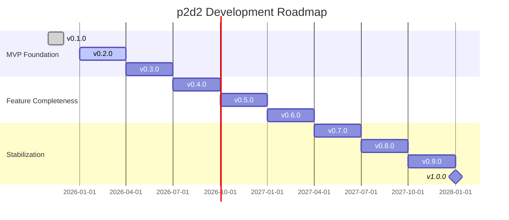

# Roadmap

## Development Phases

### Phase 1: MVP Foundation (v0.1 - v0.3)
- **v0.1.0**: Basic middleware functionality
- **v0.2.0**: Extended SDI functions
- **v0.3.0**: Performance optimizations

### Phase 2: Feature Completeness (v0.4 - v0.6)
- **v0.4.0**: Extended analysis modules
- **v0.5.0**: Security features
- **v0.6.0**: Final feature set

### Phase 3: Stabilization (v0.7 - v1.0)
- **v0.7.0**: Bugfix phase
- **v0.8.0**: Beta testing
- **v0.9.0**: Release candidate
- **v1.0.0**: Production ready

## Timeline

::: info Note
Time estimates are subject to change.
:::